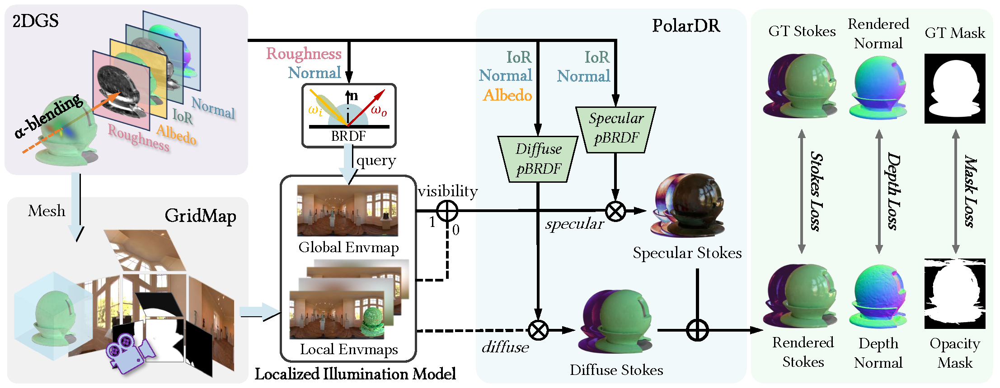

# PhyGaP: Physically-Grounded Gaussians with Polarization Cues
### [[Project]](https://kelvar00.github.io/PhyGaP) [[Paper]](https://arxiv.org/abs/2603.14001)

> [**PhyGaP: Physically-Grounded Gaussians with Polarization Cues**](https://arxiv.org/abs/2603.14001),            
> [Jiale Wu](https://kelvar00.github.io/), [Xiaoyang Bai](https://andrewbxy.github.io/), [Zongqi He](https://wuyou012.github.io/), [Weiwei Xu](http://www.cad.zju.edu.cn/home/weiweixu/weiweixu_en.htm), [Yifan Peng](https://www.eee.hku.hk/~evanpeng/)  
> **CVPR 2026 Oral**

**Official implementation of "PhyGaP: Physically-Grounded Gaussians with Polarization Cues"(CVPR 2026 Oral).** 

## Pipeline
<div align="center">
  
</div><br/>


## Get started
### Installation
This repo is still under development, but you can follow the instruction below to set up the environment and reproduce our results shown in our paper. We tested our code on ubuntu22.04 with 1 RTX 4090D GPU(CUDA  11.8).

```bash
# clone the repo
# create conda environment
conda create -n phygap python=3.8
conda activate phygap

conda install cudatoolkit=11.8 -c pytorch
pip install torch==2.0.0 torchvision==0.15.1 torchaudio==2.0.1 --index-url https://download.pytorch.org/whl/cu118

# install submodules
pip install submodules/cubemapencoder
pip install submodules/diff-surfel-rasterization
pip install submodules/simple-knn
pip install submodules/raytracing
pip install git+https://github.com/NVlabs/nvdiffrast.git --no-build-isolation
# We build our repo on nvdiffrast v0.3.1, but it has updated to v0.4.0, this should be ok.
# install other denpendencies
pip install -r requirements.txt
```


### Dateset
We provide our synthetic dataset rendered By Mistuba3, real dataset captured by 2 cameras with linear polarizers [here](https://drive.google.com/file/d/1IPni2DisjVr6KauoSnW4kRP7eY6zR55u/view?usp=drive_link) on Google Drive. Additionally, You can refer to [PolGS](https://github.com/PRIS-CV/PolGS) or [NeRSP](https://github.com/PRIS-CV/NeRSP) for SMVP3D and RMVP3D datasets. For PANDORA dataset, we resized the original images to H/4 x W/4 for training and evaluation, the resized data can be found [here](https://drive.google.com/file/d/1IPni2DisjVr6KauoSnW4kRP7eY6zR55u/view?usp=drive_link).

Note that the SMVP3D and RMVP3D datasets are in different coordinate system for our relighting scripts, so for relighting, you may need to process the images with colmap before reconstruction. **The GT surface normals of these 2 datasets are in different coordinate system with ours as well, we will provide a script to convert the surface normal later.**

The final data structure should be like:
```
PhyGaP
|--data
    |-- MitsubaSynthetic
    |    |-- mitsuba_david_museum
    |    |-- mitsuba_matpreview_museum
    |    |-- mitsuba_teapot_museum
    |
    |-- PANDORA
    |    |-- owl_quat_white
    |    |-- vase_quat_white
    |
    |-- PhyGaP
    |    |-- bud_corridor
    |    |-- ox_corridor
    |    |-- pop_garden
    |
    |-- SMVP3D
    |    |-- ...
    |
    |-- RMVP3D
         |-- ...

```

###  Train and Eval
After preparing corresponding data, you can adjust the name of scenes in `run_phygap.sh`, and run
```bash
bash run_phygap.sh
```
The output pointcloud/checkpoints will be placed under `./output/${scene_name}`. 


### Evaluation
Then run 
```bash
bash render_phygap.sh
```
This script will automatically render all scenes under `./output`, or you can run
```python
python  scripts/render_for_eval.py \
        --checkpoint "${ckpt_path}" \
        --final_iterations "${iteration}" \
        --output_dir "${out_dir}" \
        --subset both \
        --eval 
```
to render results for a single scene. Then you can run `evaluate.sh` to evaluate the results:
```bash
bash evaluate.sh
```
 This script currently support the evaluation of Mitsuba3 rendered synthetic dataset and PANDORA dataset. For our real-captured dataset, as the images are captured by 2 cameras with linear polarizers, we cannot directly compare the results with captured images, which are not included in our paper. As for the SMVP3D and RMVP3D datasets, due to the normal issue mentioned above, you can evaluate the rgb results by adding them into the `evaluate.sh` script, but for normal evaluation, please wait for the script we will provide later.

### Relighting

Instruction on relighting will be added in the future, you can try to run `relight_mitsuba_circuit.sh` with proper environment map. But I can only guarantee the script works for Mitsuba3 rendered dataset, for other datasets, especially the SMVP3D and RMVP3D datasets, there might still be some problems on coordinate system.

Replace the checkpoint path, iteration and output dir in `relight_mitsuba_circuit.sh` and run

```bash
bash relight_mitsuba_circuit.sh
```

## Notations
- **About results in our teaser:** The decomposition results are reconstructed from linear-polarized images, which are not completely suitable for RGB-only methods, so the results of RGB-only methods are degraded. So the results on teaser are only for demonstration, and the quantitative results are more fair for comparison. [GIR](https://github.com/guduxiaolang/GIR/tree/master), [GSIR](https://github.com/lzhnb/gs-ir), [3DGS-DR](https://github.com/gapszju/3DGS-DR), [R3DG](https://github.com/NJU-3DV/Relightable3DGaussian) and [Ref-Gaussian](https://github.com/fudan-zvg/ref-gaussian) are great works and we highly appreciate their efforts.
- **About the scripts:** There are several scripts in our `./scripts` folder for the readers to check the experiment process, those scripts are used for dataset generation, training and evaluation, but may need extra adjustments and environment setup to run. For example, the script `mi_render_pol.py` is used to generate Mitsuba3 rendered synthetic dataset, but it requires to install [Mistuba3](https://mitsuba.readthedocs.io/en/stable/index.html) renderer before running. And the script `construct_poisson_mesh_from_depth.py` is used to construct meshes from depth maps as we mentioned in supplementary materials, but it requires `pymeshlab` to run. 
- The code still need some clean up, if you find anything wrong or have any questions, please feel free to contact us or open an issue.

## TODO

- [x] Code release
- [x] Dataset release
- [x] Scripts for reproducing the results
- [ ] Completed Scripts for relighting
- [ ] Scripts for processing the GT normal of SMVP3D
- [ ] Explanation on parameters for training and evaluation


## Acknowledgement

This work is built on many amazing research works:

- [Ref-Gaussian](https://github.com/fudan-zvg/ref-gaussian)
- [PANDORA](https://github.com/akshatdave/pandora)

For processing the real-captured data, we utilized [lang-SAM](https://github.com/luca-medeiros/lang-segment-anything) for segmentation. And we use [COLMAP](https://github.com/colmap/colmap) for calibration. We used [Mistuba3](https://mitsuba.readthedocs.io/en/stable/index.html) for rendering the synthetic dataset. 

## 📜 BibTeX
```bibtex
@article{wu2026phygap,
  title={PhyGaP: Physically-Grounded Gaussians with Polarization Cues},
  author={Wu, Jiale and Bai, Xiaoyang and He, Zongqi and Xu, Weiwei and Peng, Yifan},
  journal={arXiv preprint arXiv:2603.14001},
  year={2026}
}
```
